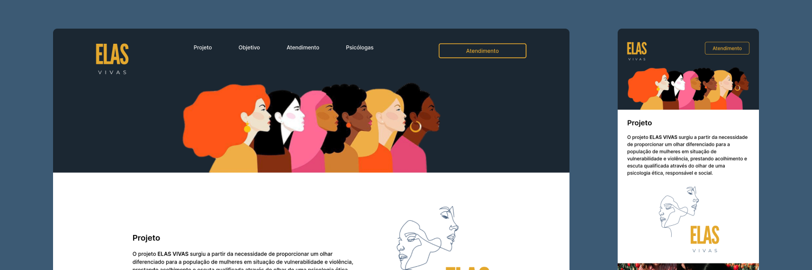

  
  
  
A space for knowledge and psychological care for women in situations of violence.

  

    <a href="#project">Project</a> · 
    <a href="#how-it-works">How it works?</a> · 
    <a href="#built-with">Built with</a> · 
  

----

## Project
The **ELAS VIVAS** project emerged from the need to provide a different look to the population of women in situations of vulnerability and violence, providing care and qualified listening through the perspective of an ethical, responsible and social psychology.

This website is a freelance service.

  

## How it works?
This website is a psychological service landing page for women, you will find two buttons (**CTA**) to be redirected to Google Forms to fill out a service form. The link is in the project description or you can [click here](https://elasvivas.netlify.app/) to be redirected.

## Built with
- [Vite](https://vitejs.dev/)
- [React](https://reactjs.org/)
- [TypeScript](https://www.typescriptlang.org/)
- [Tailwind CSS](https://tailwindcss.com/)
- [Netlify](https://www.netlify.com/)